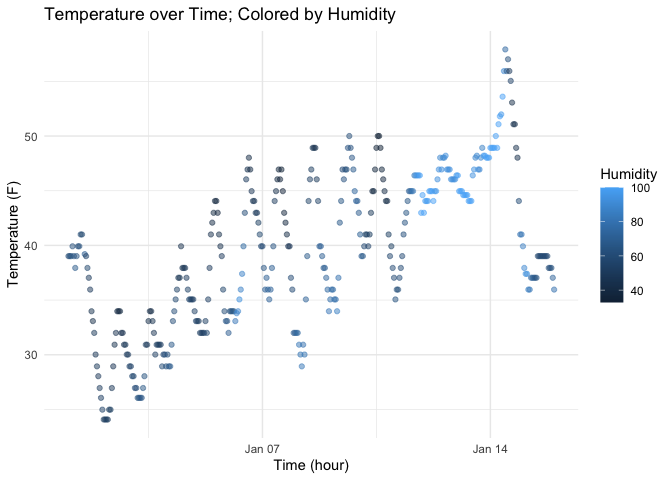

p8105_hw1_kw3041
================
2025-09-21

## Homework 1

Below, I will be loading packages and dataset needed for solving the
homework 1.

``` r
library(moderndive)
data("early_january_weather")
```

In order to answer the first question, I am going to take a look at the
dataset to assess it.

``` r
head(early_january_weather)
```

    ## # A tibble: 6 × 15
    ##   origin  year month   day  hour  temp  dewp humid wind_dir wind_speed wind_gust
    ##   <chr>  <int> <int> <int> <int> <dbl> <dbl> <dbl>    <dbl>      <dbl>     <dbl>
    ## 1 EWR     2013     1     1     1  39.0  26.1  59.4      270      10.4         NA
    ## 2 EWR     2013     1     1     2  39.0  27.0  61.6      250       8.06        NA
    ## 3 EWR     2013     1     1     3  39.0  28.0  64.4      240      11.5         NA
    ## 4 EWR     2013     1     1     4  39.9  28.0  62.2      250      12.7         NA
    ## 5 EWR     2013     1     1     5  39.0  28.0  64.4      260      12.7         NA
    ## 6 EWR     2013     1     1     6  37.9  28.0  67.2      240      11.5         NA
    ## # ℹ 4 more variables: precip <dbl>, pressure <dbl>, visib <dbl>,
    ## #   time_hour <dttm>

## Problem 1.

This data includes variables such as `temp`, which is measured in
Fahrenheit; `dewp` which is a measure of dewpoint; `humid` for relative
humidity; `wind_speed`, and a couple more variables.

## Checking the structure of “early_january_weather” tibble:

The early_january_weather dataset contains following number of rows:

``` r
nrow(early_january_weather)
```

    ## [1] 358

The early-january_weather dataset contains the following numner of
columns:

``` r
ncol(early_january_weather)
```

    ## [1] 15

The mean temperature of this dataset is:

``` r
mean(early_january_weather[["temp"]], na.rm = TRUE)
```

    ## [1] 39.58212

## Plot of the weather

In this portion I am going to access ggplot from ggplot2 package by
using function `::`. Below can be found a scatterplot of Temperature
vs. Time, colored by Humidity.

``` r
weather_plot = ggplot2::ggplot(
  early_january_weather,
  ggplot2::aes(x = time_hour, y = temp, color = humid)
) +
  ggplot2::geom_point(alpha = 0.5) + 
  ggplot2::labs(
    title = "Temperature over Time; Colored by Humidity",
    x = "Time (hour)",
    y = "Temperature (F)",
    color = "Humidity"
  ) + 
    ggplot2::theme_minimal()

weather_plot
```

<!-- -->

This is a R inline that will save the plot as a png.

``` r
ggplot2::ggsave("scatterplot_weather.png", plot = weather_plot, width = 10, height = 8)
```

## Problem 2

First, I will set a random numeric sample.

``` r
set.seed(123)
numeric_vec = rnorm(10)
```

``` r
logical_vec = numeric_vec > 0
```

``` r
char_vec = letters[1:10]
```

``` r
factor_vec = factor(sample(c("Low", "Medium", "High"), size = 10, replace = TRUE ))
```

``` r
df = data.frame(
  numeric_var = numeric_vec,
  logical_var = logical_vec,
  char_var = char_vec,
  factor_var = factor_vec
)

df
```

    ##    numeric_var logical_var char_var factor_var
    ## 1  -0.56047565       FALSE        a        Low
    ## 2  -0.23017749       FALSE        b        Low
    ## 3   1.55870831        TRUE        c        Low
    ## 4   0.07050839        TRUE        d        Low
    ## 5   0.12928774        TRUE        e       High
    ## 6   1.71506499        TRUE        f     Medium
    ## 7   0.46091621        TRUE        g       High
    ## 8  -1.26506123       FALSE        h     Medium
    ## 9  -0.68685285       FALSE        i        Low
    ## 10 -0.44566197       FALSE        j     Medium

# Numeric and Logical Mean

Now, I will be taking mean from each variable:

``` r
mean(df[ , "numeric_var"])
```

    ## [1] 0.07462564

``` r
mean(df[ , "logical_var"])
```

    ## [1] 0.5
